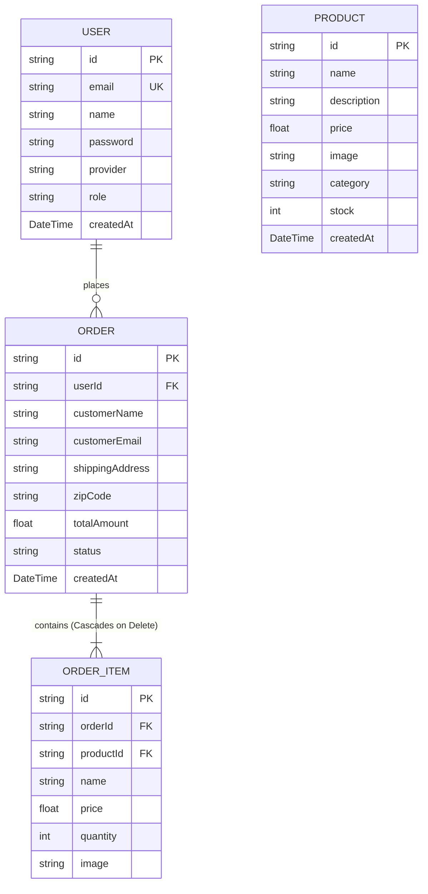

# 🛍️ Next.js Premium E-Store (ADITYA2006-05/ESTORE)

Welcome to the **Next.js Premium E-Store**—a fully featured, modern serverless e-commerce platform designed with cutting-edge styling, robust real-time administrative pipelines, and high-performance database infrastructure.

---

## 🚀 Key Features

### 🌟 Client Front Storefront
*   **Dynamic Product Catalog**: Seamless navigation across curated categories (Apparel, Accessories, Home, Daily Wear, Electronics, and Food) with real-time pricing and interactive stock badges.
*   **Micro-Animated UX**: Enhanced fluid transitions, sliding side-carts, hover states, and premium micro-interactions driven by **Framer Motion**.
*   **Seamless Shopping Cart**: Sidebar overlay with instant price tallies, itemized updates, and local persistency.
*   **Secure Authentication**: Dual authentication flow leveraging classic email/password sign-in alongside seamless **Google OAuth 2.0 Integration** for passwordless access.
*   **Streamlined Checkout**: Clean, multi-step customer logistics fields supporting guest orders or persistent registered profile purchases.

### 👑 Secure Control Panel (Admin Dashboard)
*   **Unified Tab Panel**: Central control hub for toggling between the **Inventory Database** and the **Sales pipeline**.
*   **Dynamic Inventory Manager**: Form fields with drag-and-drop image uploads (under 2MB, optimized base64 database storage) to instantly add, view, and purge product lines.
*   **Live Sales Pipeline**: Tracks client checkouts globally, featuring:
    *   Dynamic revenue aggregation in Indian Rupees (₹).
    *   Interactive status progression menus: `Placed ➡️ Processing ➡️ In Transit ➡️ Delivered`.
    *   **Full Order Deletion**: Allows clearing test/canceled orders dynamically with database cascading cleanup.

---

## 🛠️ Technology Stack

| Architecture Layer | Technology |
|---|---|
| **Core Framework** | Next.js 16 (App Router, Standalone Production Output) |
| **Frontend Runtime** | React 19 & TypeScript |
| **Styles & Layout** | Tailwind CSS v4 & Lucide React Icons |
| **Motion Physics** | Framer Motion |
| **Database Engine** | serverless PostgreSQL hosted on **Neon** |
| **ORM Adapter** | Prisma with `@prisma/adapter-neon` serverless pools |
| **Build Optimization** | Webpack Custom Builder (optimized for container stability) |

---

## 📦 Database Schema Architecture

The relational architecture is engineered in Prisma with full integrity and cascading cleanup policies:



---

## ⚙️ Configuration & Deployment Setup

### 1. Environment Configurations (`.env`)
Create a `.env` file in the root directory:
```env
# Serverless PostgreSQL Connection
DATABASE_URL="postgresql://<username>:<password>@<host>/neondb?sslmode=require"

# Google Cloud OAuth Integration Client ID
NEXT_PUBLIC_GOOGLE_CLIENT_ID="<your-google-oauth-client-id>"
```

### 2. Vercel Build Compatibility Configuration (`vercel.json`)
The deployment flow is protected against stale Prisma clients and compilation container pipe crashes:
```json
{
  "buildCommand": "prisma generate && next build --webpack",
  "outputDirectory": ".next",
  "installCommand": "npm install",
  "framework": "nextjs"
}
```

---

## 🧑‍💻 Local Development Workflow

Follow these steps to run the application in your local environment:

### Prerequisite Dependencies
Ensure you have **Node.js v22+** and **npm v10+** installed.

1.  **Clone the Repository**
    ```bash
    git clone https://github.com/ADITYA2006-05/ESTORE.git
    cd ESTORE
    ```

2.  **Install Packages**
    ```bash
    npm install
    ```

3.  **Sync Database Schema**
    ```bash
    npx prisma db push
    ```

4.  **Create Default Administrator User**
    Run the included CLI utility to register a control panel account:
    ```bash
    powershell -ExecutionPolicy Bypass -Command "npm run create-admin 'EStore Admin' 'admin@estore.com' 'AdminPassword2026!'"
    ```

5.  **Run Development Server**
    ```bash
    npm run dev
    ```
    Open `http://localhost:3000` to browse the app.

---

## 💡 Production Deployment Checklist

When deploying to Vercel:
1.  Connect your Git repository.
2.  Add `DATABASE_URL` and `NEXT_PUBLIC_GOOGLE_CLIENT_ID` to **Environment Variables** in the Project Settings.
3.  Vercel automatically detects the included `vercel.json` configurations, ensuring seamless builds!
